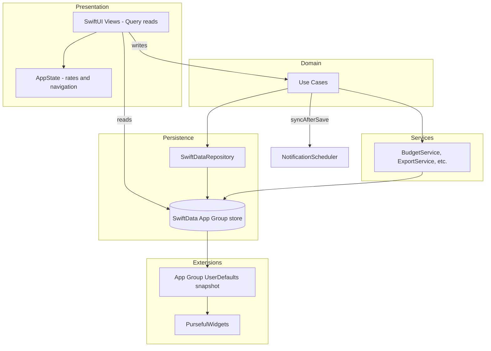

# Architecture

Purseful uses a **pragmatic clean architecture**: SwiftUI + SwiftData for UI and persistence, use cases for writes, and service enums for pure logic.

---

## Layer overview



---

## App entry & dependency injection

**File:** `purseful-ios/purseful_iosApp.swift`

1. Creates `ModelContainer` via `ModelContainerProvider`.
2. Builds `DependencyContainer(context: mainContext)`.
3. Injects into SwiftUI:
   - `.environment(appState)` — `@Observable AppState`
   - `.environment(dependencies)` — `@Observable DependencyContainer`
4. Runs `appBootstrap.runStartupTasks()` on launch.
5. Attaches `WidgetSyncObserver` for foreground sync.

### DependencyContainer

**File:** `purseful-ios/App/Composition/DependencyContainer.swift`

| Use case | Responsibility |
|----------|----------------|
| `AppBootstrapUseCase` | Seed data, sort orders, budget rollover, recurrence, notifications |
| `TransactionUseCase` | Save/delete transactions, split children |
| `BudgetUseCase` | Save/delete budgets, process rollovers |
| `PlannedPaymentUseCase` | CRUD planned payments |
| `DebtUseCase` | Debt CRUD via `DebtService` |
| `GoalUseCase` | Goals; completion transaction when linked account set |
| `CategoryUseCase` | Categories; merge reassigns tx/budgets/payments |
| `AccountUseCase` | Account CRUD |
| `ImportExportUseCase` | JSON import/export, clear data, widget sync trigger |
| `DashboardRefreshUseCase` | Pull-to-refresh pipeline |
| `ShoppingListUseCase` | Shopping list CRUD |

### Reading dependencies in views

```swift
@Environment(DependencyContainer.self) private var dependencies

try? dependencies.transactions.save(transaction: tx, isNew: true, splitLines: [])
```

Previews use `PreviewDependencies.withPreviewDependencies()`.

---

## Read vs write paths

| Operation | Pattern |
|-----------|---------|
| List transactions, budgets, etc. | `@Query` in the view |
| Create/update/delete | Use case → `repository.save()` |
| Calculations (spent, net worth) | `BudgetService`, `BalanceCalculator` (called from views with `@Query` data) |
| Export JSON | `ImportExportUseCase` → `ExportService` |

Views should **not** call `modelContext` directly except in legacy spots (e.g. `PursefulWebImportView`).

---

## Persistence

**File:** `purseful-ios/App/ModelContainerProvider.swift`

- Store path: App Group `Purseful.store`
- **Not** using CloudKit in v1 (local only)
- On corruption, store files are deleted and recreated (data loss — document for users)

**Repository:** `SwiftDataRepository` implements `DataRepositoryProtocol` (fetch, insert, delete, save, `context`).

---

## Startup sequence

`AppBootstrapUseCase.runStartupTasks()`:

1. `SeedDataService.seedIfNeeded` — system categories
2. `AccountPreferences.ensureSortOrders`
3. `BudgetUseCase.processRollovers` — advance budget periods
4. `RecurrenceProcessor.processDueItems` — auto-create due planned payments
5. `NotificationScheduler.syncAll`

---

## Foreground & refresh sync

| Trigger | Actions |
|---------|---------|
| App launch | Bootstrap (above) |
| Scene becomes active | `WidgetSyncObserver`: rollover, widget snapshot, `NotificationScheduler.syncAll` |
| Dashboard pull-to-refresh | Exchange rates + `DashboardRefreshUseCase.refresh` |
| After most saves | `NotificationScheduler.syncAfterSave` (async) |

---

## AppState

**File:** `purseful-ios/App/AppState.swift`

- Exchange rate cache in memory + `ExchangeRateCache` (UserDefaults)
- Tab selection, planning section, Spotlight pending IDs
- `refreshExchangeRates()` → `ExchangeRateService` (Frankfurter API)

---

## Services vs use cases

**Use cases** — orchestrate persistence + side effects (notifications, widget sync hooks).

**Services** — pure or side-effecting utilities:

| Service | Role |
|---------|------|
| `BudgetService` | Period ranges, spent amount, rollover processing |
| `BalanceCalculator` | Balances, net worth, currency conversion |
| `CategoryService` | Resolve “Other” category, debt-only categories |
| `DebtService` | Debt categories, repayments, linked transactions |
| `RecurrenceProcessor` | Auto transactions from planned payments |
| `ExportService` / `ImportService` | JSON v2 |
| `ReportSummaryBuilder` / `ReportPDFExportService` | Reports PDF export |
| `NotificationService` / `NotificationScheduler` | Local notifications |
| `ReceiptScanner` / `ReceiptParser` | On-device OCR (PL fiscal heuristics) |
| `AccentTheme` | Accent page wash and solid list/form surfaces |
| `SpotlightService` | Core Spotlight indexing |
| `WidgetDataSync` | App Group JSON for widgets |
| `PursefulWebImportService` | Import from web app backup |
| `BankSyncService` / `EnableBankingService` | Prepared, disabled in v1 |

---

## Navigation

**File:** `purseful-ios/App/MainTabView.swift`

| Tab | View |
|-----|------|
| 0 Dashboard | `DashboardView` |
| 1 Transactions | `TransactionsView` |
| 2 Budgets | `BudgetsView` |
| 3 Planned | `PlanningView` |
| 4 Reports | `ReportsView` |

Settings is reached from the Dashboard toolbar. Deep links: URL scheme `purseful://`, widget links, Spotlight via `AppState.handleSpotlightIdentifier`.

---

## Multi-target layout

| Target | Purpose |
|--------|---------|
| `purseful-ios` | Main app |
| `PursefulWidgets` | WidgetKit extension (reads App Group snapshot) |
| `purseful-iosTests` | Unit tests |

Shared constants: `AppConstants.appGroupIdentifier`.

---

## Related ADRs

- [001 — Use-case layer](decisions/001-use-case-layer.md)
- [002 — Local persistence without CloudKit](decisions/002-local-persistence-v1.md)
- [003 — Planned payments instead of recurring transactions](decisions/003-planned-payments-not-recurring-transactions.md)
