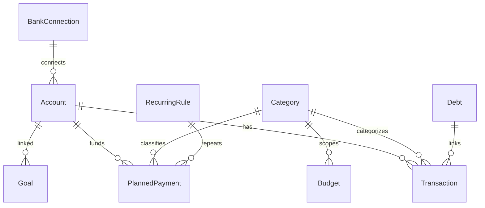

# Data model

All persistent entities are SwiftData `@Model` types registered in `ModelContainerProvider.schema`.

Storage: **App Group** container at `Purseful.store` (see [architecture.md](architecture.md)).

---

## Entity relationship overview

Transfers use a second Account link on Transaction (`toAccount`). Split transactions use `parentTransactionID` on child rows. Categories can form a parent/child tree (self-referential, not shown).

---

## Account

**File:** `purseful-ios/Models/Account.swift`

| Field | Type | Notes |
|-------|------|-------|
| `id` | UUID | Primary key |
| `name` | String | |
| `type` | AccountType | cash, debitCard, creditCard, savings, loan |
| `currency` | String | ISO 4217 |
| `initialBalance` | Decimal | Starting balance |
| `colorHex`, `icon` | String | UI |
| `includeInTotal` | Bool | Net worth inclusion |
| `isHidden` | Bool | Hidden from pickers/lists |
| `sortOrder` | Int | Display order |

**Computed balance:** `initialBalance` + sum of linked transactions (`BalanceCalculator.currentBalance`). Not stored.

---

## Transaction

**File:** `purseful-ios/Models/Transaction.swift`

| Field | Type | Notes |
|-------|------|-------|
| `id` | UUID | |
| `title`, `note` | String | |
| `amount` | Decimal | Always positive; sign from `type` |
| `type` | TransactionType | income, expense, transfer |
| `date` | Date | |
| `account`, `toAccount` | Account? | Transfer uses both |
| `category` | Category? | Optional for transfers |
| `attachmentData` | Data? | Receipt JPEG |
| `transactionCurrency`, `exchangeRate` | Optional | Foreign amount; rate → base when set |
| `parentTransactionID` | UUID? | Split child marker |
| `importSourceID` | String? | Bank/web import dedup |
| `isRecurring`, `recurringRule` | Legacy fields | Prefer planned payments |

**Split transactions:** Parent holds total; children have `parentTransactionID` and per-category amounts. Budget/report math uses children when present.

---

## Category

**File:** `purseful-ios/Models/Category.swift`

| Field | Type | Notes |
|-------|------|-------|
| `name`, `icon`, `colorHex` | | |
| `type` | CategoryType | income / expense |
| `parent` | Category? | Subcategories |
| `isSystem` | Bool | Cannot delete (can hide) |
| `isHidden` | Bool | Excluded from pickers; toggle “Show Hidden” in Settings |
| `sortOrder` | Int | |

System debt categories (names in `AppConstants`) are created by `DebtService.ensureDebtCategories`.

---

## Budget

**File:** `purseful-ios/Models/Budget.swift`

| Field | Type | Notes |
|-------|------|-------|
| `amount` | Decimal | Base limit per period |
| `period` | BudgetPeriod | weekly, monthly, custom |
| `customStartDate`, `customEndDate` | Date? | For custom period |
| `category` | Category? | `nil` = all spending |
| `rollover` | Bool | Carry unused amount forward |
| `rolloverAmount` | Decimal | Added to limit when rollover on |
| `rolloverPeriodStart` | Date? | Last period rollover was applied for |
| `alertThreshold` | Double | 0–1, e.g. 0.8 = 80% alert |

**Effective limit:** `amount + (rollover ? rolloverAmount : 0)` — see [decisions/004-budget-rollover.md](decisions/004-budget-rollover.md).

---

## PlannedPayment

**File:** `purseful-ios/Models/PlannedPayment.swift`

Bills, subscriptions, scheduled transfers.

| Field | Type | Notes |
|-------|------|-------|
| `frequency` | PaymentFrequency | once, daily, weekly, biweekly, monthly, yearly |
| `type` | TransactionType | expense, income, or transfer |
| `nextDueDate` | Date | |
| `autoCategorize` | Bool | `RecurrenceProcessor` creates tx on due date |
| `reminderDaysBefore` | Int | Notification lead time |
| `lastPaidDate` | Date? | Mark-as-paid tracking |

---

## Debt

**File:** `purseful-ios/Models/Debt.swift`

| Field | Notes |
|-------|-------|
| `direction` | iOwe / theyOwe |
| `originalAmount`, `remainingAmount` | |
| `linkedTransactions` | Opening + repayment txs |

Repayments use system categories via `DebtService`.

---

## Goal

**File:** `purseful-ios/Models/Goal.swift`

| Field | Notes |
|-------|-------|
| `targetAmount`, `currentAmount` | Progress |
| `targetDate` | Optional deadline |
| `linkedAccount` | Optional; income tx on **completion** only |
| `isCompleted` | |

---

## RecurringRule

**File:** `purseful-ios/Models/RecurringRule.swift`

Attached to planned payments for complex schedules (`daysOfWeek`, interval, end date).

---

## BankConnection

**File:** `purseful-ios/Models/BankConnection.swift`

Stub for Enable Banking. Tokens belong in Keychain, not SwiftData.

---

## ShoppingListItem

**File:** `purseful-ios/Models/ShoppingListItem.swift`

Extra feature (not in original spec): parsed shopping list from text, optional prices.

---

## UserDefaults (non-SwiftData)

**File:** `purseful-ios/App/AppSettings.swift`

| Key | Purpose |
|-----|---------|
| `baseCurrency` | Display currency |
| `accentColorHex` | App tint |
| `defaultAccountID` | Quick-add default |
| `dailySpendCategoryIDs` | Reports / lock screen spend |
| `weeklySummaryEnabled` | Notification toggle |
| `exchangeRatesCache` | Frankfurter cache |
| `bankSyncBetaEnabled` | Future bank sync flag (no UI yet) |

Budget alert dedup keys: `budgetAlert.{budgetID}.{periodStart}.{level}` in UserDefaults.

---

## Enums

**File:** `purseful-ios/Models/Enums.swift`

`AccountType`, `TransactionType`, `CategoryType`, `BudgetPeriod`, `PaymentFrequency`, `DebtDirection`, etc.

---

## JSON export

Full backup format documented in [import-export.md](import-export.md). Export omits split **child** rows; import recreates splits from parent metadata where applicable.

---

## Schema changes

SwiftData lightweight migration is implicit. Breaking changes may trigger store reset logic in `ModelContainerProvider.makeContainer` (destructive). Document migrations in an ADR when changing production schema.
