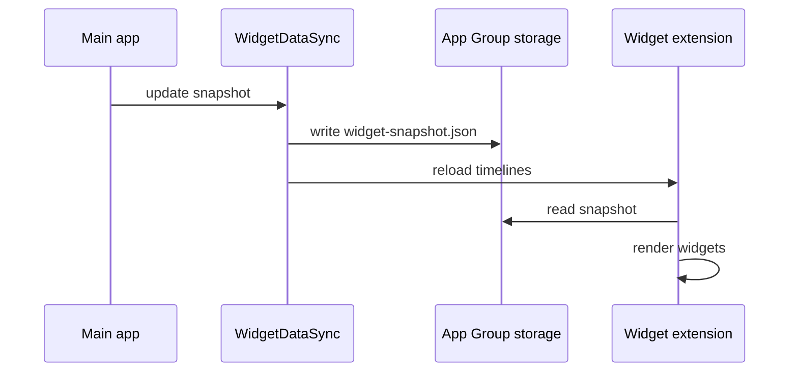

# Widgets

WidgetKit extension **PursefulWidgets** reads a JSON snapshot written by the main app into the shared App Group.

---

## App Group

| Constant | Value |
|----------|-------|
| Identifier | `group.dev.imflawlezz.purseful-ios` |
| Snapshot file | `widget-snapshot.json` |
| SwiftData store | `Purseful.store` (same container) |

Entitlements required on **both** app and widget targets.

---

## Data flow

**When snapshot updates:**

- Dashboard pull-to-refresh
- App foreground (`WidgetSyncObserver`)
- Import/export clear
- Other paths calling `ImportExportUseCase.syncWidgets`

---

## Widget types

| Widget | Family | Content |
|--------|--------|---------|
| `AccountBalanceWidget` | systemSmall | First visible account balance |
| `BudgetProgressWidget` | systemMedium | First budget spent vs limit |
| `RecentTransactionsWidget` | systemLarge | Last 5 transactions |
| `TodaySpendWidget` | accessoryRectangular / inline | Today’s expenses in base currency |

Timeline refresh: ~15 minutes (`PursefulProvider.getTimeline`).

---

## Snapshot selection rules

**File:** `Services/WidgetDataSync.swift`

| Field | Source |
|-------|--------|
| Account | First account where `!isHidden`, by `sortOrder` |
| Budget | First budget by name sort |
| Today spend | Sum of expenses today (base currency, split-aware via `BalanceCalculator`) |
| Recent txs | 5 newest non-split children |

No user-configurable widget intents in v1.

---

## Deep links

Widgets use URL scheme **`purseful://`**:

| Host | Tab |
|------|-----|
| `dashboard` | 0 |
| `transactions` | 1 |
| `budgets` | 2 |
| `planning` | 3 |
| `reports` | 4 |

Handled in `MainTabView.handleDeepLink`.

---

## Development notes

1. Run the **main app** at least once so snapshot exists.
2. Widget previews use placeholder data in `PursefulProvider.placeholder`.
3. Exchange rates for budget/today spend come from `ExchangeRateCache` at sync time.
4. Widget bundle version must match app `MARKETING_VERSION` (1.0.0).

---

## Files

| Path | Role |
|------|------|
| `PursefulWidgets/PursefulWidgets.swift` | Widget definitions & views |
| `PursefulWidgets/WidgetDataSync.swift` | Read helpers (duplicate of app-side writer pattern) |
| `purseful-ios/Services/WidgetDataSync.swift` | Write snapshot + reload timelines |

---

## Known limitations

- “Monthly Budget” label shown even for weekly budgets.
- Single account/budget only — no `AppIntent` configuration.
- Stale until app syncs or timeline reloads.
