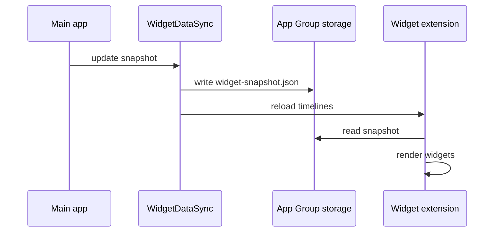

# Widgets

WidgetKit extension **PursefulWidgets** reads a JSON snapshot written by the main app into the shared App Group.

---

## App Group

| Constant | Value |
|----------|-------|
| Identifier | `group.dev.imflawlezz.purseful-ios` |
| Snapshot file | `widget-snapshot.json` |
| SwiftData store | `Purseful.store` (same container) |

Entitlements required on **both** app and widget targets.

---

## Data flow

**When snapshot updates:**

- Dashboard pull-to-refresh
- App foreground (`WidgetSyncObserver`)
- Transaction save/delete
- Import/export / clear all data
- Other paths calling `ImportExportUseCase.syncWidgets` / `WidgetDataSync.sync(using:)`

---

## Widget types

Four kinds — dense home/lock surfaces, not one-metric clones:

| Widget | Families | Configuration | Content |
|--------|----------|---------------|---------|
| `BalancesWidget` | systemSmall, systemMedium | Account (App Intent) | Primary + up to 4 other balances (app order); medium right: spent today + upcoming payments with titles |
| `BudgetProgressWidget` | systemMedium | Budget (App Intent) | Remaining hero, spent/limit, period, progress ring |
| `RecentTransactionsWidget` | systemLarge | — | Last 6 txs + spent today + next payment (title + amount + date) |
| `TodaySpendLockWidget` | accessoryInline / Rectangular | — | Lock Screen spent today; rectangular next due as amount + date only |

Timeline refresh: ~15 minutes. Accent wash from snapshot `accentColorHex`. Stale snapshots (`updatedAt` older than 24h or missing) show “Open Purseful to refresh”.

---

## Snapshot fields

**Writer:** `purseful-ios/Services/WidgetDataSync.swift`  
**Reader:** `PursefulWidgets/WidgetDataSync.swift`

| Field | Source |
|-------|--------|
| `accentColorHex` | `AppSettings.accentColorHex` |
| `baseCurrency` | `AppSettings.baseCurrency` |
| `accounts[]` | Visible accounts (default account first); balance via `BalanceCalculator` |
| `budgets[]` | Name, period display name, spent / limit / remaining in base currency |
| `goals[]` | Incomplete goals: current, target, color |
| `todaySpend` | Expenses today in base currency |
| `netWorth` | `BalanceCalculator.netWorth` |
| `recentTransactions[]` | 6 newest non-split-child txs (date desc): title, amount, type, category color |
| `upcomingPayments[]` | Active unpaid planned payments by due date (up to 8) |
| `updatedAt` | Sync timestamp |

---

## App Intents

| Intent | Entity | Widget |
|--------|--------|--------|
| `SelectAccountIntent` | `AccountEntity` | Balances |
| `SelectBudgetIntent` | `BudgetEntity` | Budget |

Suggested entities come from the latest snapshot; open the app once after adding accounts/budgets so the picker lists them.

---

## Deep links

| Host | Tab |
|------|-----|
| `dashboard` | 0 |
| `transactions` | 1 |
| `budgets` | 2 |
| `planning` | 3 |
| `reports` | 4 |

Scheme: `purseful://`. Handled in `MainTabView.handleDeepLink`.

---

## Development notes

1. Run the **main app** at least once so the snapshot exists.
2. Placeholders use `WidgetDataSync.placeholderSnapshot()`.
3. Exchange rates for budget / today spend / net worth come from `ExchangeRateCache` at sync time.
4. Widget bundle version must match app `MARKETING_VERSION`.

---

## Files

| Path | Role |
|------|------|
| `PursefulWidgets/PursefulWidgets.swift` | Widget definitions & views |
| `PursefulWidgets/WidgetIntents.swift` | Account / budget configuration intents |
| `PursefulWidgets/WidgetFormatting.swift` | Money formatting, accent background |
| `PursefulWidgets/WidgetDataSync.swift` | Snapshot reader |
| `purseful-ios/Services/WidgetDataSync.swift` | Snapshot writer + `sync(using:)` |
